# Snake DQN Training Report

## Executive Summary

The useful training history is:

1. Early resume/scratch experiments confirmed that the original setup was not learning enough from short runs.
2. Double DQN + Prioritized Experience Replay became the stable baseline.
3. The 10M run showed real learning, reaching a best eval of `29.8` apples.
4. The 15M continuation improved the stable average, ending with MA50 around `21.4` apples.
5. The 25M continuation with lower epsilon floor and LR decay was the strongest completed run, ending with MA50 around `26.2` apples.

Current best model:

- Checkpoint: `checkpoints/model_best.safetensors`
- Selected from experiment: 25M resume, GPU, Double DQN, PER, epsilon floor `0.05`, LR decay
- Best eval checkpoint step: `24,046,584`
- Best eval batch: `38.8` apples, `38.2495` score over `5` eval episodes
- Best recorded training GIF: `training_gifs/24_25m_best_score_49p603.gif`

## Main Completed Runs

| Experiment | Status | Steps | Algorithm / replay | Resume | Final eval apples | Final MA50 apples | Best eval apples | Best training GIF |
|---|---:|---:|---|---|---:|---:|---:|---:|
| 10M resume | Completed | `10,000,000` | Double DQN + PER | `5,400,000` | `13.6` | `17.768` | `29.8` at `9,805,623` | `30.370` |
| 15M resume | Completed | `15,000,000` | Double DQN + PER | `10,250,000` | `24.8` | `21.392` | `34.0` at `12,970,221` | `32.491` |
| 25M resume, epsilon `0.05` + LR decay | Completed | `25,000,000` | Double DQN + PER | `14,990,000` | `23.6` | `26.220` | `38.8` at `24,046,584` | `49.603` |

Notes:

- PER means `SNAKE_REPLAY_SAMPLING_STRATEGY=prioritized`.
- The 25M run used `SNAKE_EPSILON_END=0.05`.
- The 25M run used LR decay from `0.00025` at `15M` to `0.000125` at `25M`.
- Final single eval can be noisy. The 25M final eval was moderate, but MA20/MA50 were the best sustained averages we saw.

## Milestone Run Details

### 10M Resume Run

Experiment label: 10M resume, GPU, Double DQN, PER

Configuration:

- Resumed from `checkpoints/model_step_5400000.safetensors`
- Double DQN
- Prioritized replay, alpha `0.6`, beta start `0.4`, beta anneal `200,000`
- Batch size `32`
- Train every `4`
- Gradient clip norm `10`

Results:

- Finished at `10,000,000` steps.
- Last eval: `13.6` apples, `13.8911` score.
- End MA50: `17.768` apples, `17.2638` score.
- Best eval: `29.8` apples, `29.4922` score at step `9,805,623`.
- Best training GIF score: `30.370` at step `8,064,191`.

Assessment:

- This was the first run where learning was clearly non-trivial.
- Performance was still volatile, but it proved the Double DQN + PER setup could learn.

### 15M Resume Run

Experiment label: 15M resume, GPU, Double DQN, PER

Configuration:

- Resumed from `checkpoints/model_step_10250000.safetensors`
- Double DQN
- Prioritized replay, alpha `0.6`, beta start `0.4`, beta anneal `200,000`
- Batch size `32`
- Train every `4`
- Gradient clip norm `10`

Results:

- Finished at `15,000,000` steps.
- Last eval: `24.8` apples, `24.0891` score.
- End MA5: `23.0` apples.
- End MA10: `22.7` apples.
- End MA20: `22.81` apples.
- End MA50: `21.392` apples.
- Best eval: `34.0` apples, `33.4543` score at step `12,970,221`.
- Best training GIF score: `32.491` at step `13,716,172`.

Assessment:

- The continuation from 10M to 15M produced a clear sustained improvement.
- This run established the baseline to beat: roughly low-20s average apples over longer eval windows.

### 25M Resume Run

Experiment label: 25M resume, GPU, Double DQN, PER, epsilon floor `0.05`, LR decay

Configuration:

- Resumed from `checkpoints/model_step_14990000.safetensors`
- Double DQN
- Prioritized replay, alpha `0.6`, beta start `0.4`, beta anneal `200,000`
- `epsilonEnd=0.05`
- LR decay from `0.00025` to `0.000125` over `15M -> 25M`
- Batch size `32`
- Train every `4`
- Gradient clip norm `10`

Results:

- Finished at `25,000,000` steps.
- Last eval: `23.6` apples, `22.8394` score.
- End MA5: `23.32` apples.
- End MA10: `25.78` apples.
- End MA20: `26.28` apples.
- End MA50: `26.22` apples.
- Best eval: `38.8` apples, `38.2495` score at step `24,046,584`.
- Best training GIF score: `49.603` at step `20,302,201`.

Assessment:

- This is the strongest completed run.
- The final single eval was not the best point, but the long moving averages improved substantially.
- Lower epsilon floor plus LR decay appears beneficial compared with the 15M baseline.

## Qualitative Trend

The learning curve improved in stages:

- Around `1M-2.5M`, the agent mostly failed to eat apples consistently.
- Around `10M`, it learned enough to produce high-teens moving averages and occasional near-30 apple evals.
- Around `15M`, the average moved into the low 20s.
- Around `25M`, the average moved into the mid 20s, with best eval batches near `39` apples and a best single training episode near `50` apples.

The policy still has high variance. Even late in the 25M run, eval windows included occasional poor batches, but the sustained moving averages improved.

Representative best-episode GIFs, extracted to `training_gifs/`:

### 01. Failure: immediate terminal state

Score: `-1.000`

### 02. Barely survives past the start

Score: `0.014`

### 03. First useful apple collection

Score: `1.052`

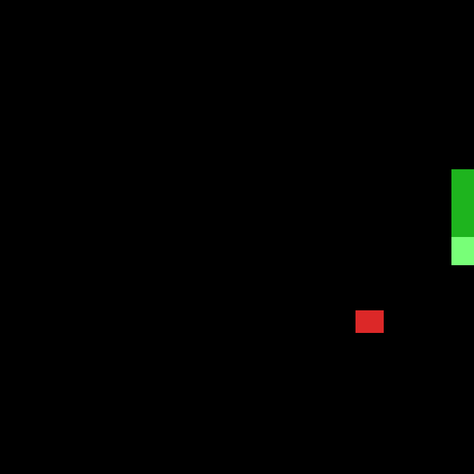

### 04. Two-apple episode

Score: `2.076`

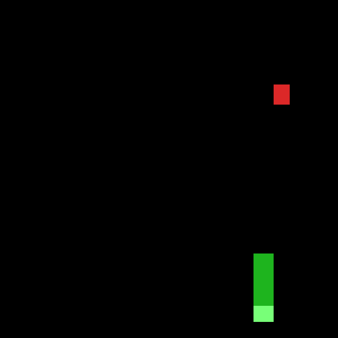

### 05. Short chain with shaping experiment

Score: `3.195`

### 06. Early resumed run reaches four apples

Score: `4.097`

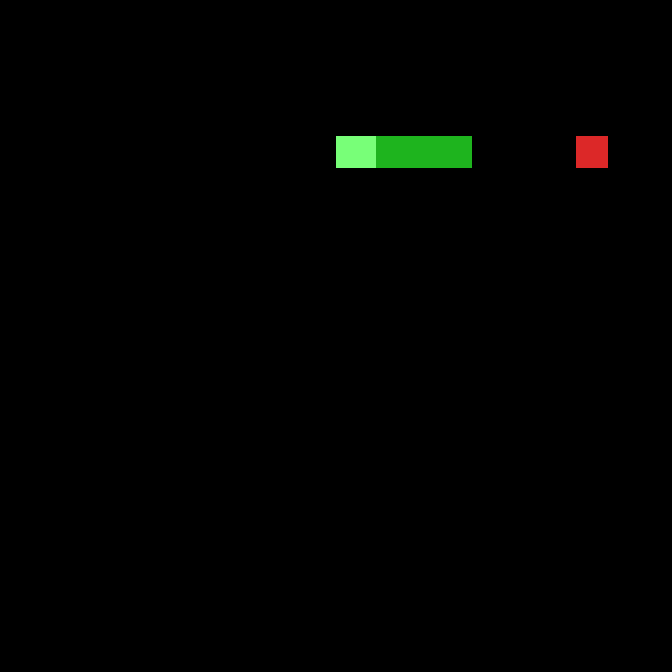

### 07. GPU resume starts improving

Score: `5.096`

### 08. 10M run starts producing longer episodes

Score: `8.095`

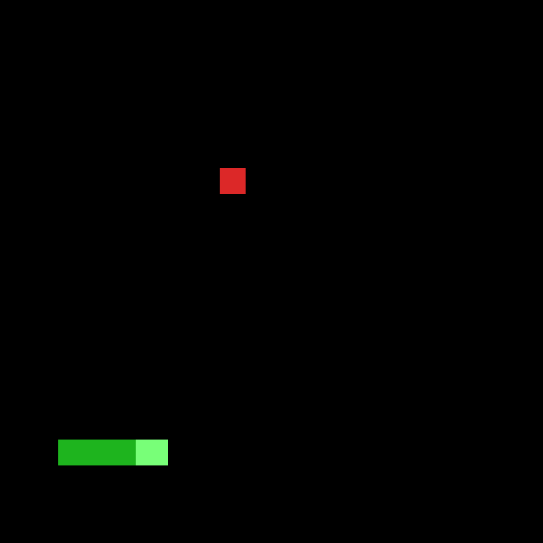

### 09. 10M run crosses ten score

Score: `10.160`

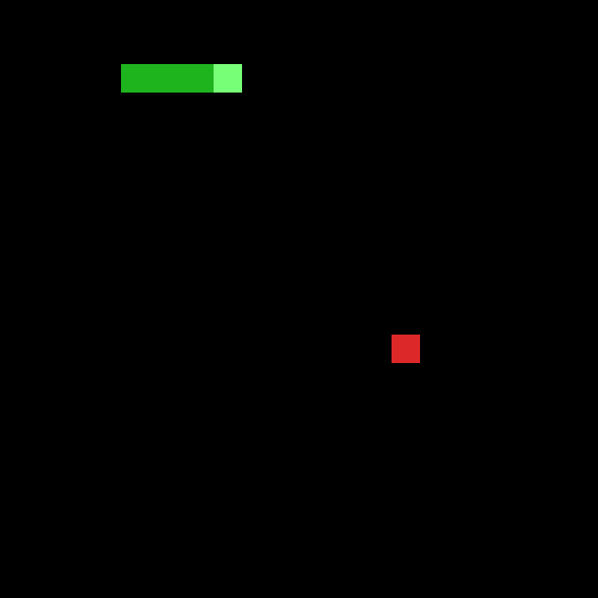

### 10. 10M run becomes meaningfully stable

Score: `14.234`

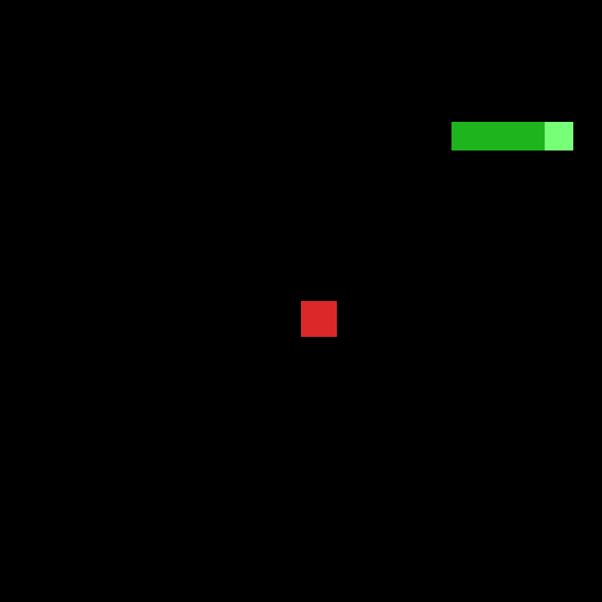

### 11. 10M run high-teens episode

Score: `18.262`

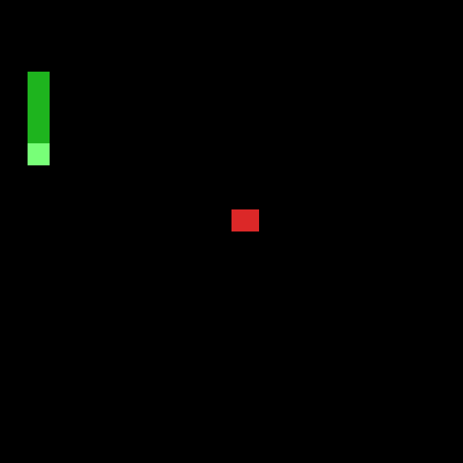

### 12. 10M run low-20s episode

Score: `21.263`

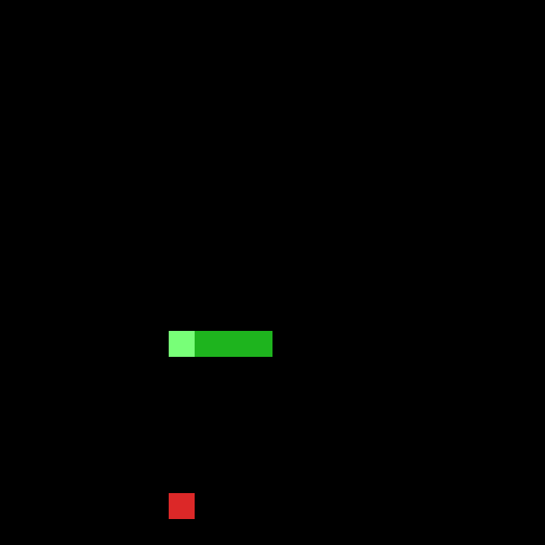

### 13. 10M breakthrough episode

Score: `25.390`

### 14. Best 10M recorded training episode

Score: `30.370`

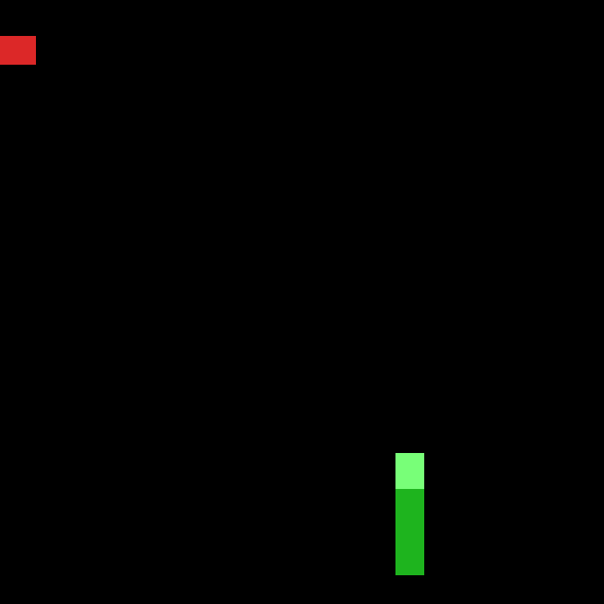

### 15. 15M continuation pushes higher

Score: `31.483`

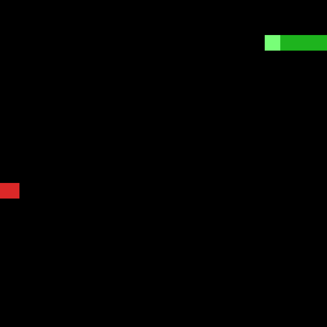

### 16. Best 15M recorded training episode

Score: `32.491`

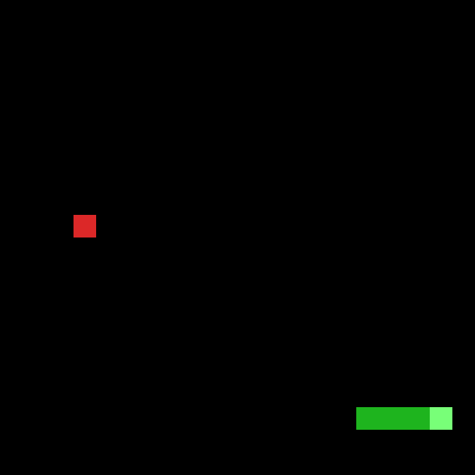

### 17. 25M continuation starts above 15M best

Score: `33.480`

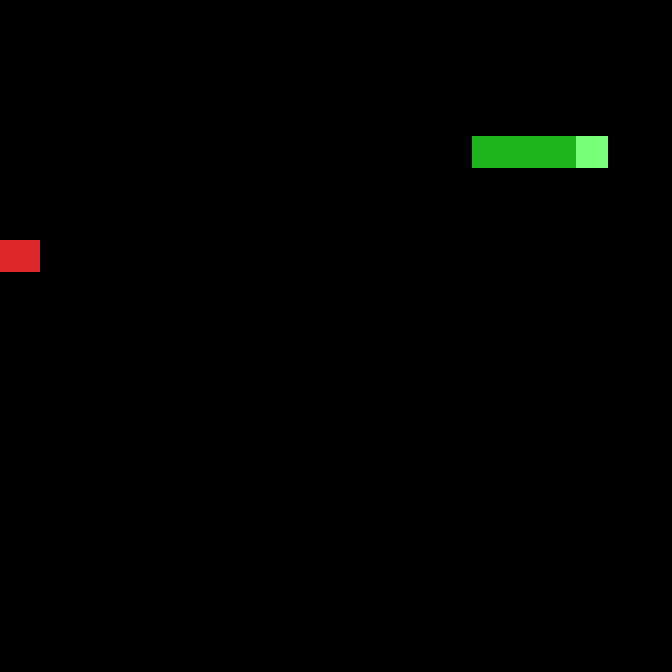

### 18. 25M continuation improves again

Score: `34.461`

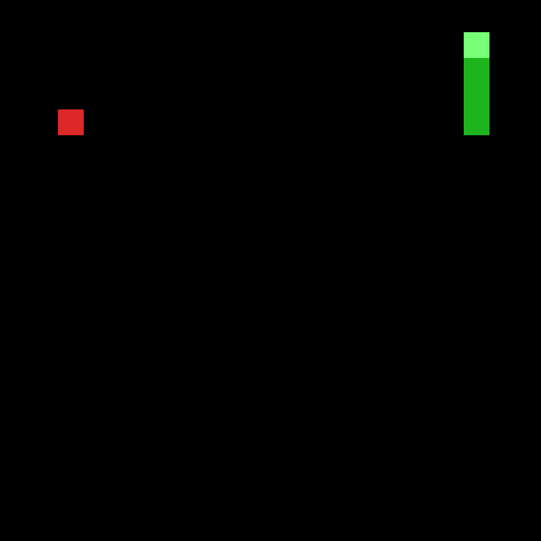

### 19. 25M mid-run stronger episode

Score: `35.417`

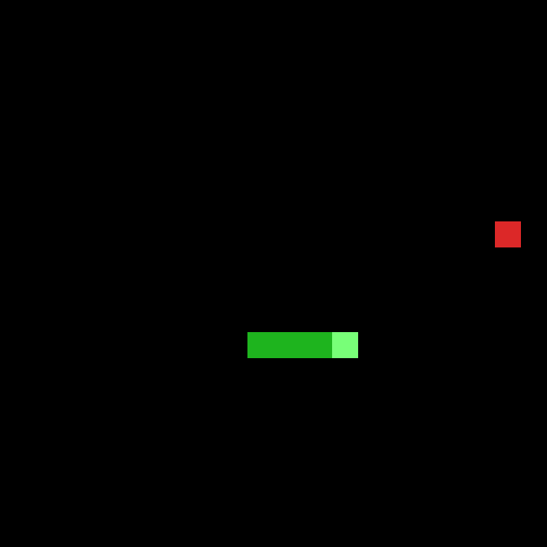

### 20. 25M reaches mid-30s consistently

Score: `36.420`

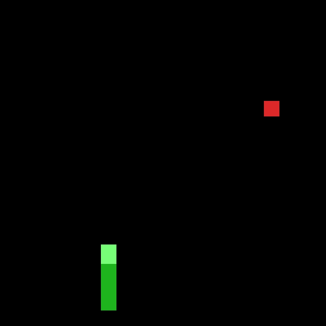

### 21. 25M crosses high-30s

Score: `38.592`

### 22. 25M near-40 episode

Score: `39.556`

### 23. 25M strong episode after LR decay

Score: `45.547`

### 24. Best recorded training episode

Score: `49.603`

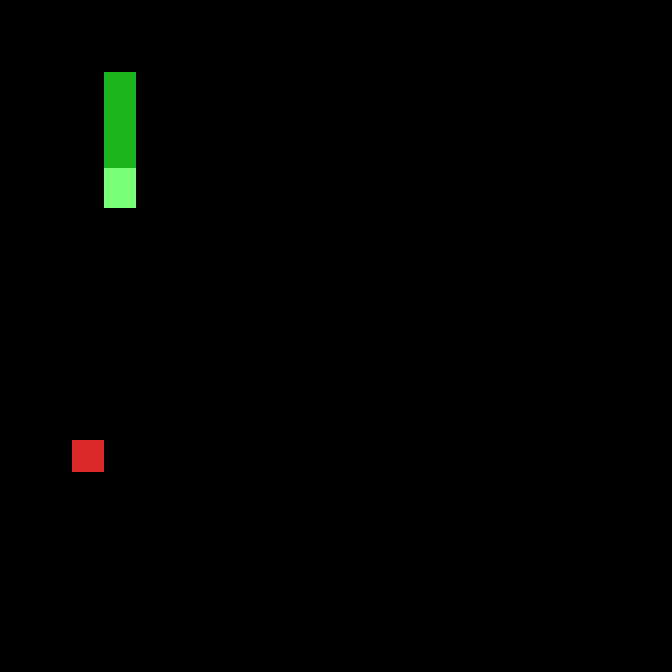

## Best Artifacts

- Best checkpoint: `checkpoints/model_best.safetensors`
- Best checkpoint provenance: 25M run, step `24,046,584`
- Best eval metric: `38.8` apples / `38.2495` score over `5` episodes
- Best training GIF: `training_gifs/24_25m_best_score_49p603.gif`
- Extracted representative GIFs: `training_gifs/`

## Takeaways

- Double DQN + PER was necessary for useful progress.
- Longer training mattered materially; 5M was too short, while 15M and 25M showed clear improvements.
- Potential-based shaping did not show a useful early signal in the short scratch run.
- The 25M run suggests lower late-stage exploration and LR decay can improve sustained performance.
- The next reliable comparison should use stronger fixed-seed eval, ideally more than `5` episodes, but eval runtime becomes significant for strong policies.
